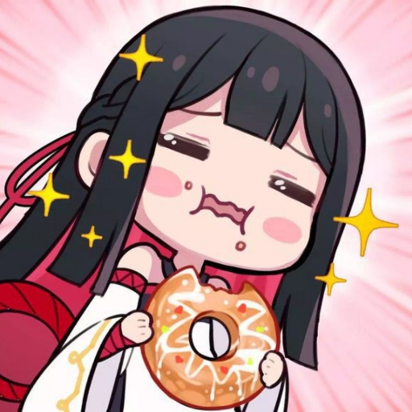

  

## GiveawayBot#0643

A feature-rich, easy-to-use Discord bot for managing interactive giveaways. Built using [`discord.py`](https://github.com/Rapptz/discord.py), this bot lets server admins and moderators quickly set up and manage giveaways with a modern interface using buttons, views, and modals.

---

## Invite
If you'd like to add **GiveawayBot** to your server, use the following link: 
🔗 **[https://giveaway.bot/invite](https://discord.com/oauth2/authorize?client_id=1356864811803348992&scope=bot+applications.commands&permissions=2147829824)**

## Usage
### Commands  
  * **/ghelp** - Shows the available commands
  * **/gabout** - Shows information about the bot
  * **/ginvite** - Shows a link to add the bot to your server
  * **/gcreate** - Interactive giveaway setup
  * **/gstart \<time> \<winners> \<prize>** - Starts a new giveaway in the current channel. Users can click the button to enter the giveaway. The time can be in seconds, minutes, hours, or days. Specify the time unit with an "s", "m", "h", or "d", for example `30s` or `2h`.
  * **/gend \<giveaway_id>** - Ends a giveaway and picks the appropriate number of winners immediately
  * **/gdelete \<giveaway_id>** - Deletes the specified giveaway without picking winners
  * **/glist** - Lists currently-running giveaways on the server.
  * **/greroll \<giveaway_id>** - Picks a new winner from the specified giveaway. You can also right-click (or long-press on mobile) on an ended giveaway and select Apps > Reroll Giveaway to reroll.
  * **/gsettings show** - Shows GiveawayBot's settings on the server. Some settings are set automatically, such as locale.
  * **/gsettings set color \<hex_code>** - Sets the color of the embed used for giveaways
  * **/gsettings set emoji \<emoji>** - Sets the emoji or text used on the button to enter giveaways

### Buttons  
  * Press the button on an active giveaway to enter the giveaway
  * Press the giveaway summary button on an ended giveaway to view a summary of a giveaway

---
